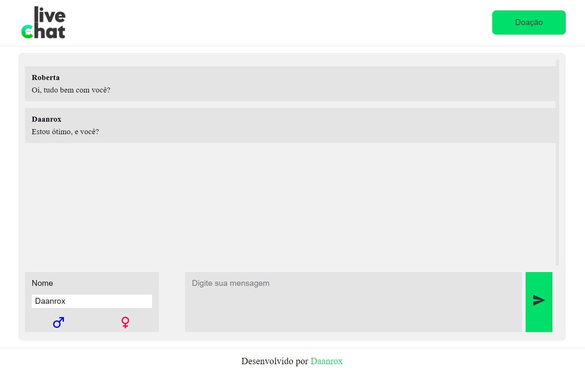

# LiveChat
Chat em tempo real utilizando WebSockets (Aplicação em desenvolvimento)

## Descrição

Um WebChat que utiliza Socket.io para renderizar mensagens ao vivo entre os participantes da conversa.

### Deploy
Aplicação em produção: [https://livechat-rox.vercel.app](https://livechat-rox.vercel.app)

## Tecnologias Utilizadas

  
  
  
  

## Funcionalidades
- **Mini perfil:** O usuário poderá escolher, o nome e gênero para que os outros usuários o identifiquem
- **Mensagens instantâneas:** Renderização de mensagens em tempo real

## Futuras implantações
- Para melhorar a experiência, irei adicionar futuramente um sistema de cadastro e autenticação
- Uma possível Feature com opções de salas com temas e interesses específicos.
- Gerenciador de amizades, onde será possível identificar seus amigos online no momento. 

## Contato
Se tiver dúvidas ou precisar de mais informações, sinta-se à vontade para entrar em contato:
- Email : [contato@daanrox.com](mailto:contato@daanrox.com)
- LinkedIn: [https://www.linkedin.com/in/daanrox/](Daanrox)

--- 

"Consagre ao Senhor tudo o que você faz, e os seus planos serão bem-sucedidos."

